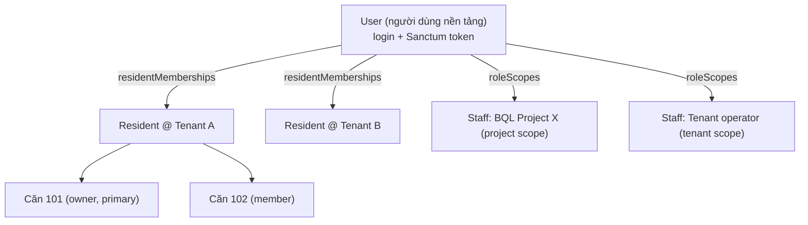
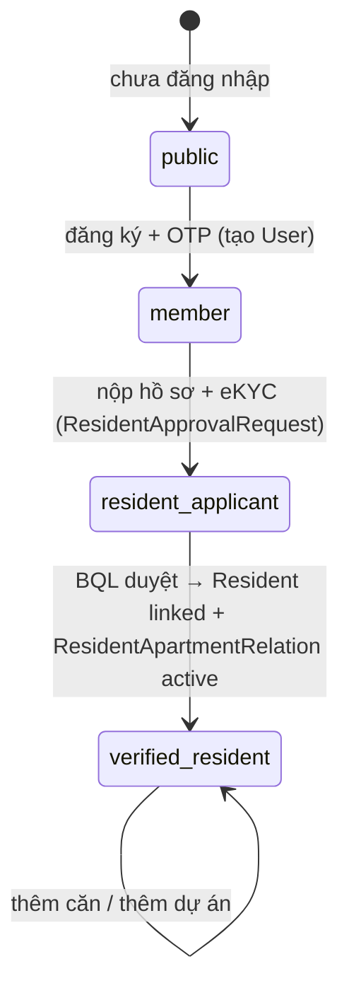
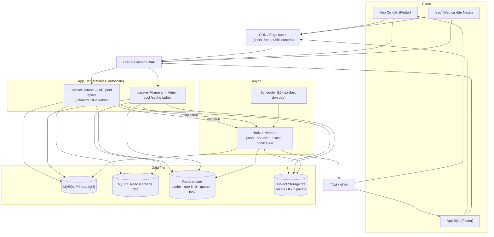
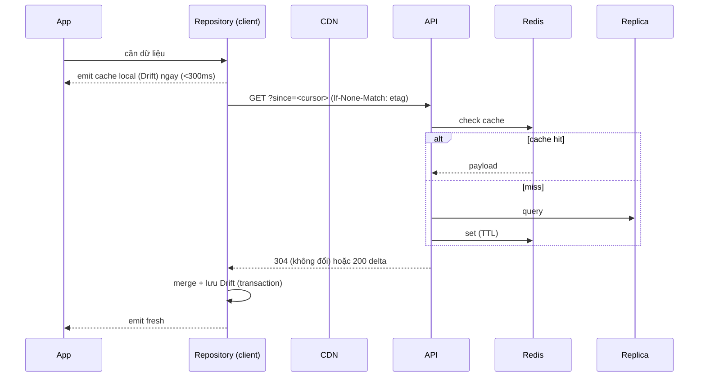
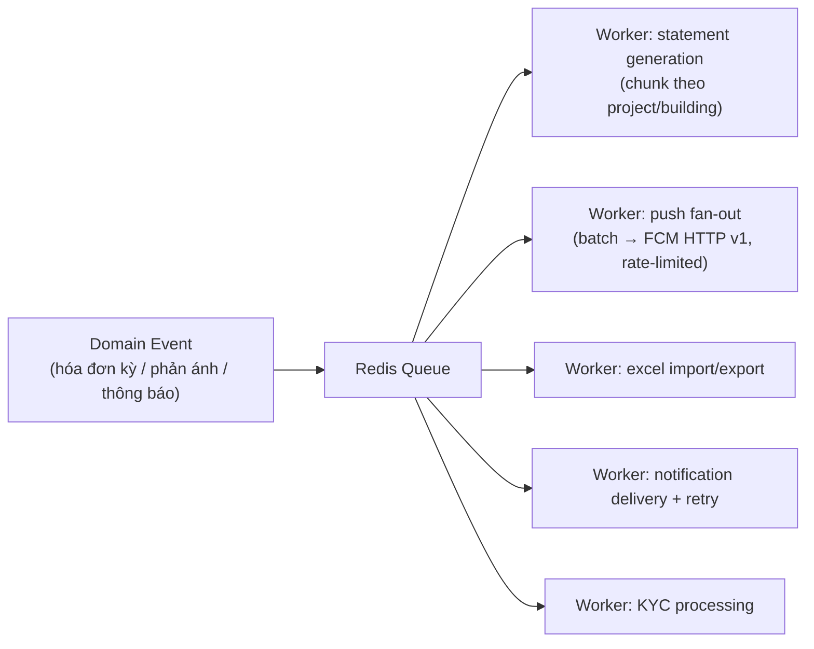
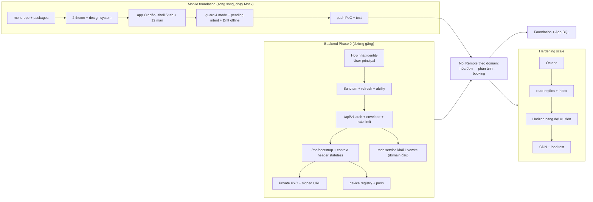

# Kiến trúc nền tảng X2-BMS — Backend chịu tải triệu cư dân + App Flutter (Cư dân & BQL)

> **Phiên bản:** V1 · **Ngày:** 2026-07-18
> **Phạm vi:** Thiết kế kiến trúc thống nhất cho (a) backend Laravel API-first có khả năng scale tới 1–5 triệu cư dân và (b) khung app Flutter cho hai đối tượng: Cư dân và Ban quản lý (BQL).
> **Mục tiêu:** Chốt kiến trúc TRƯỚC khi dựng khung app, tránh lặp lại nợ kỹ thuật của hệ cũ (XBooking / x1).
> **Trạng thái:** Bản thiết kế để review & chốt. Các mục "Quyết định cần chốt" ở cuối phải được duyệt trước khi code.

---

## 0. Bài học nền tảng từ x1 (XBooking cũ)

| x1 đã làm | Hệ quả | X2 làm khác |
|---|---|---|
| 3 backend (Laravel + Bun/Elysia + CMS) **chung 1 MySQL** | Auth & logic nghiệp vụ nhân bản 2 lần, dễ lệch, khó bảo trì | **1 backend Laravel** là nguồn sự thật duy nhất |
| Viết lại API bằng Bun vì sợ Laravel quá tải | Chưa dùng hết Octane/Horizon/Redis đã có sẵn | Scale bằng **Octane + Redis + read-replica + queue + scale ngang**, không đổi runtime |
| Không refresh token, token sống mãi | Rủi ro bảo mật | **Access ngắn + refresh rotate**, device-bound |
| Secret hardcode trong source | Rò rỉ | Toàn bộ ra **env/secret manager** |
| Gần như không offline | UX kém khi mạng yếu | **Offline-first** (Drift) → giảm mạnh tải đọc backend |
| KYC lưu public | Lộ PII | **Private storage + signed URL + consent (NĐ13/2023)** |

**Nguyên tắc vàng:** chỉ tách microservice khi một đường nóng có đặc tính cực đoan, và service đó **sở hữu schema riêng** — KHÔNG bao giờ đọc chung DB như x1.

---

## 1. Giả định quy mô & nguyên tắc

### 1.1 Giả định tải (điều chỉnh theo số thật)
- Tổng cư dân: **1M → 5M** (theo cảnh báo trong README x2web).
- Tài khoản staff/BQL: **~10k** (theo `User::canAccessPanel`).
- DAU cư dân: ~10–20% → **100k–200k**.
- Đặc tính tải: **đọc >> ghi** (xem tin/dự án/hóa đơn/thông báo), ghi tập trung vào vài đường (đăng ký cư dân, phản ánh, thanh toán, booking).
- **Spike có tính chu kỳ:** phát hành hóa đơn theo kỳ (hàng triệu bản/tháng) và push fan-out (hàng triệu thiết bị) → **bắt buộc chạy nền qua queue, không đồng bộ trong request.**

### 1.2 Nguyên tắc kiến trúc
1. **API-first, stateless.** Mọi client (app cư dân, app BQL, sau này web Next.js) dùng chung `/api/v1`. Không state trong session cho mobile.
2. **Một backend, nhiều instance.** Scale ngang sau load balancer.
3. **Đọc rẻ, ghi kỷ luật.** Đọc phục vụ từ cache/replica/CDN; ghi qua service + policy + idempotency.
4. **Offline-first ở client** = tầng cache phân tán miễn phí, giảm tải backend.
5. **Việc nặng → queue.** Push, hóa đơn, Excel, thông báo, KYC đều async.
6. **Bảo mật & PII mặc định bật.** Private media, rate limit, mask PII, consent.
7. **Admin (Filament) tách khỏi API mobile** về mặt vận hành (pool riêng) để tải cư dân không ảnh hưởng BQL và ngược lại.

---

## 2. Mô hình danh tính & phân quyền (đã hợp nhất)

### 2.1 Một "người dùng nền tảng", nhiều context

`User` là **danh tính nền tảng duy nhất** (login + Sanctum). Một người có thể mang nhiều "mũ" đồng thời:



- **Cư dân nhiều căn:** `Resident` → `ResidentApartmentRelation` (`role`: owner/tenant/member, `is_primary`).
- **Cư dân nhiều dự án:** `User::residentMemberships()` (bỏ tenant scope).
- **Vừa BQL vừa cư dân:** cùng `User` có cả `roleScopes` (staff) lẫn `residentMemberships` (cư dân).

### 2.2 Vòng đời cư dân ↔ 4 experience mode (app)



### 2.3 RBAC 3 tầng (staff/BQL)
`UserRoleScope` = cấp một role trong phạm vi `platform | tenant | project | building`. Nguồn sự thật cho BQL. Cư dân **không** dùng RBAC này; quyền cư dân suy ra từ `ResidentApartmentRelation` đang active.

### 2.4 QUYẾT ĐỊNH BẮT BUỘC — hợp nhất identity
- **Giữ `User` + `Resident` + `ResidentApartmentRelation` + `ResidentApprovalRequest`** làm stack chính.
- **Khai tử/giáng cấp** stack addendum `GlobalUserAccount` + `ResidentUnitBinding` + `ResidentBindingRequest` (chỉ giữ làm view/registry nếu cần cho SaaS admin; không dùng cho auth/mobile).
- **Bỏ ý nghĩa loại trừ của `User.account_type`**: vai trò suy ra từ quan hệ. `account_type` chỉ còn là gợi ý gốc/UX.
- Thêm `$hidden` cho PII (`id_no`, `dob`) trên `User`/`Resident` để không lộ khi serialize.

---

## 3. Kiến trúc hệ thống tổng thể



**Điểm then chốt:**
- **API pool và Admin pool tách nhau** (cùng codebase, khác deployment/scale group). Tải 5M cư dân không đụng tới BQL.
- **Octane** giữ app thường trú → bỏ chi phí bootstrap mỗi request, connection pool sẵn → throughput/1 core cao gần bằng Node.
- **Redis** đa nhiệm: cache, rate limit, queue (Horizon), distributed lock (giữ slot booking, chống double-submit).

---

## 4. Tầng API `/api/v1`

### 4.1 Không gian route
- `/api/v1/public/*` — không cần token (bootstrap, projects, content). Cache mạnh + CDN.
- `/api/v1/auth/*` — otp/login/refresh/logout, `/me/sessions`.
- `/api/v1/me/*` — hồ sơ, device tokens, notifications inbox, contexts.
- `/api/v1/resident/*` — nghiệp vụ cư dân (hóa đơn, phản ánh, booking...). `auth:sanctum` ability `resident` + scope theo `ResidentApartmentRelation`.
- `/api/v1/bql/*` — nghiệp vụ BQL. `auth:sanctum` ability `staff` + policy theo `UserRoleScope`.

### 4.2 Token & phiên
- **Sanctum**: access token ngắn hạn (vd 15–60') + **refresh token dài hạn, rotate mỗi lần refresh**, hash-at-rest, device-bound (gắn `X-Device-Id`).
- **Ability**: gắn `resident` / `staff` vào token; endpoint kiểm ability + policy.
- App: **refresh mutex** (chỉ 1 request refresh cùng lúc), 401 → refresh đúng 1 lần → fail thì về login nhưng giữ public cache.

### 4.3 Context stateless
- Bỏ session `CurrentContext`. Client gửi **`X-Context-Id`** (id của một `ResidentApartmentRelation` hoặc scope BQL) khi cần.
- Server **chỉ chấp nhận** context mà user đang có quan hệ active; sai → `403 ContextRevoked`.
- `GET /me/bootstrap` trả `experience_mode`, `available_contexts`, `permissions`, `enabled_modules`, `branding`, `unread_notification_count`, `minimum_app_version`.

### 4.4 Chuẩn hợp đồng (contract)
- **Envelope:** success `{data, meta:{request_id, server_time, next_cursor?, has_more?}}`; error `{error:{code, message, fields?, retryable}, meta:{request_id}}`.
- **Pagination:** cursor (không offset) — ổn định ở bảng lớn.
- **Delta-sync:** `?since=<cursor|timestamp>` + **ETag/If-None-Match** → client chỉ tải phần thay đổi → giảm tải đọc.
- **Idempotency:** header `Idempotency-Key` bắt buộc cho ghi nhạy cảm (thanh toán, submit hồ sơ, booking) → chống double-submit, an toàn retry.
- **Versioning thật:** prefix `/api/v1`; breaking change → `/api/v2`.
- **PII:** money = integer minor-unit hoặc decimal string (không double); date ISO-8601 UTC; API Resource ẩn CCCD/dob, chỉ trả bản mask khi cần.
- **DTO nguồn sự thật:** OpenAPI; không suy field từ DB.

### 4.5 Rate limit (Redis)
| Nhóm | Giới hạn gợi ý |
|---|---|
| OTP request | 3–5 / SĐT / 10 phút + backoff |
| Login | 10 / IP+device / phút |
| Đọc public | 120 / phút / IP |
| Đọc có token | 300 / phút / user |
| Ghi thanh toán/booking | 10 / phút / user + Idempotency-Key |

---

## 5. Tầng dữ liệu & scale

- **Primary/Replica:** ghi vào primary, đọc từ replica (Laravel read/write connection). Feed/tin/hóa đơn (đọc nhiều) → replica.
- **Chỉ mục (index):** phủ các truy vấn nóng (`resident_apartment_relations` theo apartment/resident; `statements` theo resident+kỳ; `notifications` theo audience). Tránh N+1 (eager load bắt buộc).
- **Phân vùng dữ liệu lớn:** `statements`/`statement_lines`, `notification_delivery_log`, `activity_log` — cân nhắc partition theo kỳ/tháng hoặc archive lạnh khi > ngưỡng.
- **Tenancy scoping an toàn:** trait `BelongsToTenant` no-op trong console/queue → **job phải set context tenant tường minh** (đây là rủi ro rò dữ liệu; bắt buộc review). Cư dân `tenant_id` NULL → API cư dân **scope thủ công** theo `ResidentApartmentRelation`.
- **Tách logic khỏi Livewire:** bóc nghiệp vụ từ Filament Page → `app/Services/*` để web-admin và API dùng chung một service (không nhân bản như x1).

---

## 6. Caching & offline-first (đòn bẩy scale lớn nhất)



- **3 tầng cache:** CDN (asset/public content) → Redis (server) → Drift/SQLite (client offline-first).
- Public content SWR; user data cache-first + refresh ngắn; notification inbox delta 5'.
- Kết quả: phần lớn lượt "đọc của triệu cư dân" **không chạm DB primary**.

---

## 7. Xử lý bất đồng bộ (Horizon/queue)



- **Hàng đợi ưu tiên:** `emergency` > `default` > `bulk` (hóa đơn/push khối lượng lớn không chặn việc gấp).
- **Push fan-out** tới triệu thiết bị: batch + rate-limit theo quota FCM, ghi `notification_delivery_log`, retry có backoff.
- **Phát hành hóa đơn kỳ:** scheduler kích job, chunk theo building; idempotent theo (resident, kỳ).
- **Excel** (Maatwebsite): import chunk + queue + validation + dry-run, không làm trong request.

---

## 8. Push notification & device registry

- **Provider:** FCM (Android trực tiếp, iOS qua APNs). OneSignal chỉ là adapter tùy chọn về sau.
- **Bảng mới `mobile_devices`:** `installation_id` (unique), `user_id` (nullable — cho phép public opt-in), `platform`, `provider`, `push_token` (mã hóa), `app_version`, `locale`, `timezone`, `notification_permission`, `last_seen_at`, `token_refreshed_at`, `revoked_at`, `metadata`.
- **Endpoints:** `POST /me/devices`, `PATCH/DELETE /me/devices/:id`.
- **Payload contract:** `additionalProperties:false`; chỉ `notification_id, event_type, route_name (allowlist), schema_version, sent_at (+ entity_id, context_id)`. **KHÔNG** gửi PII/CCCD/số căn/công nợ. Notification center backend là source of truth; push chỉ là tín hiệu.
- **Channel Android:** `emergency_high`, `resident_service`, `finance`, `community`, `marketing`.
- **Topic** chỉ dùng cho public/non-sensitive (mã dự án opaque); nội dung nhạy cảm resolve token từ backend.

---

## 9. Media & KYC (private)

- Chuyển KYC (`id_front/id_back/portrait`) từ disk `public` → **disk `local` private** (đang là production blocker).
- Truy cập qua **temporary signed URL** + route kiểm policy; validate `mime` + `maxSize`.
- **Consent** (NĐ13/2023): bảng consent + log redaction; xóa cache KYC client sau upload/logout.
- Upload lớn: cân nhắc pre-signed upload thẳng S3 để không nghẽn app tier.

---

## 10. Bản kế hoạch năng lực (capacity plan — ước lượng)

> Con số để định cỡ ban đầu; hiệu chỉnh bằng load test.

| Hạng mục | Ước lượng | Ghi chú |
|---|---|---|
| Peak API RPS (cư dân) | ~1.000–1.500 rps | 150k DAU, đọc chủ đạo, đa số hit cache |
| App tier (API) | 4–8 node Octane, autoscale | mỗi node vài trăm rps JSON cache |
| Admin tier | 2 node | tải ~10k staff, tách riêng |
| MySQL | 1 primary + 2–3 replica | đọc dồn replica |
| Redis | cluster 3 node (HA) | cache+queue+ratelimit+lock |
| Horizon workers | 3–6 node, scale theo backlog | tách hàng đợi bulk |
| Statement kỳ | hàng triệu bản → job chunk qua đêm | idempotent |
| Push fan-out | hàng triệu msg → batch rate-limited | vài chục phút, không đồng bộ |
| Object storage | S3 (media/KYC) + CDN | signed URL cho private |

**Nút thắt thật, theo thứ tự cần tối ưu:** DB (index/N+1/replica) → cache hit-rate → queue throughput. **Không** phải runtime PHP.

---

## 11. Quan sát & bảo mật

- **Observability:** structured log + `X-Request-Id` xuyên suốt; metrics (RPS, p95 latency, queue backlog, cache hit-rate, DB replica lag); crash/error monitoring; health check tổng hợp (DB/Redis/queue/worker).
- **Security gates:** secret ra env; refresh rotation + revoke; rate limit login/OTP/thanh toán; row-level policy theo tenant/relation; private KYC + signed URL; mask PII trong log; idempotency; validate upload. (Cân nhắc port ý tưởng **request-signing + anti-replay** của x1 cho endpoint thanh toán.)

---

## 12. Kiến trúc App Flutter (Cư dân + BQL)

### 12.1 Monorepo — nền chung, hai app
```text
x2_mobile/
├── packages/
│   ├── x_core            # dio client, envelope, error mapping, X-headers, request-id
│   ├── x_auth            # token store, refresh mutex, session, ability
│   ├── x_design_system   # theme navy + champagne_gold, component dùng chung
│   ├── x_storage         # drift (SQLite), secure storage, prefs, cache SWR
│   ├── x_notifications    # FCM, device registry, notification inbox, deep link
│   └── x_context          # experience mode / context switch / RBAC client mirror
├── apps/
│   ├── resident_mobile/   # theo Foundation V1 (12 màn đầu + nghiệp vụ cư dân)
│   └── bql_mobile/        # nghiệp vụ vận hành BQL (cần foundation riêng — xem 13)
```

Kiến trúc mỗi app: **feature-first, 4 lớp** (Presentation → Application/Domain ← Data). Riverpod + go_router + Dio + Drift + freezed. UI **chỉ** gọi Repository interface; chạy Mock trước, nối Remote khi `/api/v1` xác nhận.

### 12.2 Khác biệt hai app
| | App Cư dân | App BQL |
|---|---|---|
| Experience/permission | 4 mode: public→member→applicant→verified_resident | staff, scope theo `UserRoleScope` (project/building) |
| Quyền hiển thị | mirror theo `ResidentApartmentRelation` | mirror theo RBAC 3 tầng |
| Feature | dự án/tin, đăng ký cư dân (eKYC), hóa đơn/thanh toán, phản ánh, booking, thông báo | duyệt hồ sơ, xử lý phản ánh/work-order (checklist hiện trường), công nợ, duyệt booking, khách/QR, gửi thông báo |
| Offline | cao (hóa đơn/tin xem offline) | vừa (checklist work-order hiện trường) |
| Push channel | finance/community/emergency | service/emergency/assignment |

### 12.3 Bản đồ App ↔ Backend (một ngôn ngữ contract)
Mỗi feature client ↔ 1 nhóm endpoint `/api/v1/...` ↔ 1 service Laravel ↔ model/table. Enum đồng bộ Laravel ↔ DTO Flutter (kỷ luật học từ x1). Không có backend thứ 2.

---

## 13. Trình tự triển khai (roadmap) — đường găng: Backend Phase 0



**Thứ tự đề xuất:**
1. **Backend Phase 0** (đường găng) — hợp nhất identity → auth token → `/api/v1` → bootstrap/context → private media → device/push → tách service.
2. **Mobile foundation** (song song, dùng Mock) — dựng monorepo + app Cư dân V1 theo Foundation handoff.
3. **Nối Remote** từng domain khi API sẵn sàng.
4. **App BQL** — soạn foundation BQL (thiếu, cần viết) rồi build.
5. **Hardening scale** — Octane → replica/index → Horizon → CDN → load test (làm dần, kích hoạt trước khi lên tải thật).

---

## 13b. Scale Readiness Checklist — trạng thái thực tế (cập nhật 2026-07-18)

> **Kết luận:** kiến trúc ĐÃ thiết kế cho triệu user, nhưng phần ĐÃ DỰNG/BẬT thì CHƯA. Hiện `.env`
> đang dồn cache/queue/session vào MySQL → chỉ hợp dev, chưa chịu tải thật. Chỉ "load test đạt"
> mới khẳng định được năng lực, không suy đoán.

| # | Hạng mục | Trạng thái | Ghi chú |
|---|---|---|---|
| — | API stateless `/api/v1` | ✅ done | điều kiện tiên quyết scale ngang |
| — | Envelope + cursor + delta-sync (contract) | ✅ done | chưa áp lên endpoint nghiệp vụ (chưa có) |
| — | Token device-bound + identity hợp nhất | ✅ done | |
| 1 | `CACHE_STORE` → Redis | ❌ đang `database` | tác động lớn nhất, rẻ nhất |
| 2 | `QUEUE_CONNECTION` → Redis + **Horizon** | ❌ đang `database`, Horizon chưa cài | tách hàng đợi emergency/default/bulk |
| 3 | `SESSION_DRIVER` → Redis (admin) | ❌ đang `database` | |
| 4 | **Octane** (FrankenPHP/Swoole) | ❌ chưa cài | throughput API pool |
| 5 | Read replica + tách read/write | ❌ chưa cấu hình | dồn đọc sang replica |
| 6 | Index + eager-load truy vấn nóng; cache `me/bootstrap` | ❌ chưa | |
| 7 | Sửa `BelongsToTenant` no-op trong queue | ❌ chưa | rủi ro rò dữ liệu tenant ở job |
| 8 | CDN asset/public content | ❌ chưa | |
| 9 | Load test (k6/Locust) nghiệm thu năng lực | ❌ chưa | tiêu chí "đạt" thật sự |

**Lưu ý:** rate limiter + OTP hiện dùng `cache=database` nên đang LÀM TĂNG tải DB. Chuyển Redis (mục 1) trước khi mở tải.

## 14. Quyết định cần chốt trước khi code

1. **Hợp nhất identity về `User`** (khai tử `GlobalUserAccount` stack)? — *khuyến nghị: Có.*
2. **Vòng đời token:** access TTL bao lâu, refresh rotate + device-bound? — *khuyến nghị: access 30', refresh rotate.*
3. **Monorepo mobile** 2 app + packages chung? — *khuyến nghị: Có.*
4. **Kích hoạt scale ngay hay theo cột mốc tải?** — *khuyến nghị: thiết kế sẵn (replica/queue/cache), bật Octane+replica từ đầu, autoscale sau.*
5. **Ai/đội nào làm Backend Phase 0** (đường găng — app không nối thật nếu thiếu).
6. **Foundation App BQL:** viết mới dựa trên nền chung — cần lên lịch (Foundation V1 mới chỉ có app Cư dân).
