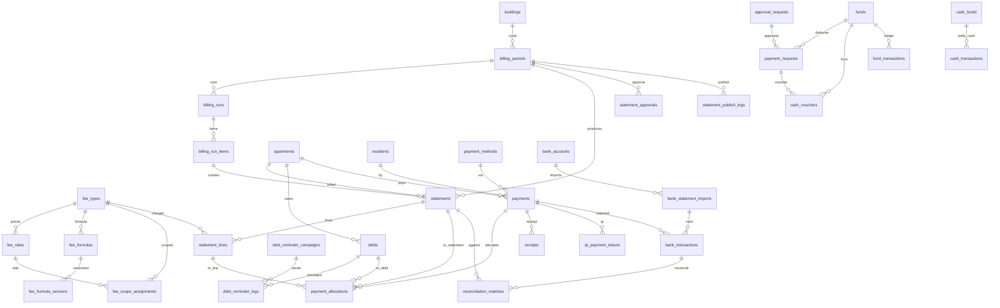
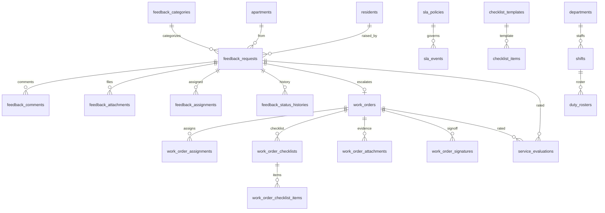
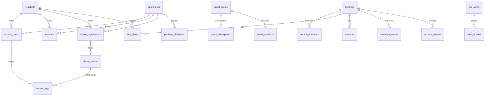
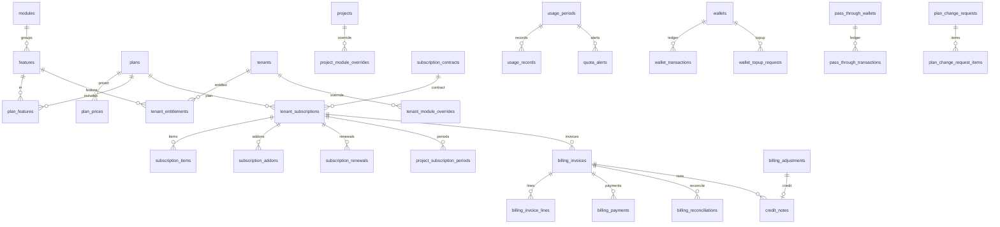
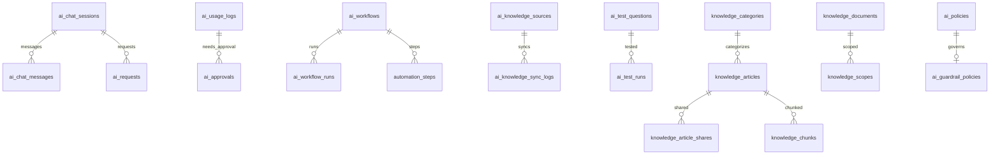

# ERD hiện trạng & Đánh giá CSDL X2-BMS — 2026-07-03

> **Nguồn:** introspect trực tiếp MySQL `x2bms` đang chạy (không đọc migration, vì migration add-only + có bảng đã drop/rename).
> **Quy mô:** **326 bảng** = **303 bảng nghiệp vụ + 23 bảng `_archive`** (Batch 08 soft-delete). **691 khoá ngoại**. 65 migration đã chạy.
> **Đối chiếu mục tiêu:** `docs/CANONICAL_ENTITY_MAP.md` (6 tier). Lưu ý: canonical gốc được phủ 100% ở ~185 bảng (mốc 2026-07-01); scope sau đó phình lên khi nhận thêm handoff mới (addendum/Batch 07-08-10/HQ) → 303. **Số bảng không phải thước đo mục tiêu** — xem §9.1. Bản `ERD_DRAFT.md` cũ chỉ phủ pilot Tier 1–3 → tài liệu này thay thế.
> Ký hiệu mermaid: chỉ vẽ FK thật (belongsTo). Cột tenancy `tenant_id → project_id → building_id → apartment_id` xuất hiện ở hầu hết bảng nghiệp vụ (row-level tenancy) — lược bớt trong sơ đồ cho gọn.

---

## 1. Tổng quan theo domain

| # | Domain | Bảng | Rows (seed) | Ghi chú |
|---|---|---:|---:|---|
| 1 | ORG_TENANCY | 12 | 1.437 | Xương sống đa tầng: tenant→company→project→building→floor→apartment |
| 2 | IDENTITY_RBAC | 13 | 380 | users + spatie roles/permissions + user_role_scopes + staff_profiles + global_user_accounts |
| 3 | RESIDENT | 6 | 2.715 | residents (1.306) + relation + binding SaaS (global account ↔ căn) |
| 4 | FEE_BILLING | 17 | **8.720** | Nặng nhất: statement_lines 7.212, statements 1.360 |
| 5 | PAYMENT | 17 | 69 | Thu/chi/quỹ/ngân hàng/đối soát |
| 6 | FEEDBACK_SLA | 9 | 211 | Phản ánh + SLA engine (polymorphic) |
| 7 | WORKORDER | 10 | 292 | Lệnh việc + checklist + ký nghiệm thu + ca trực |
| 8 | SECURITY_ACCESS | 17 | 297 | Thẻ/xe/khách/tuần tra/SOS/camera/IOC |
| 9 | ASSET_MAINT | 12 | 36 | Tài sản/bảo trì/đồng hồ/IoT/nhà thầu-hợp đồng |
| 10 | NOTIFICATION | 5 | 28 | Thông báo 3-tier + audience/channel/read |
| 11 | AMENITY | 4 | 21 | Tiện ích + đặt chỗ + QR |
| 12 | FORMS | 7 | 40 | Form builder động |
| 13 | COMMUNITY | 7 | 21 | Bài viết/sự kiện/bình chọn |
| 14 | ECOSYSTEM | 15 | 50 | Marketplace/loyalty/BĐS/smart-home |
| 15 | LIFECYCLE | 5 | 33 | Bàn giao/bảo hành |
| 16 | APPROVAL_AUDIT | 5 | 18 | approval_requests/steps + audit_logs + activity_logs |
| 17 | SAAS_PLAN | 9 | 193 | Feature-gate: plans/features/modules/entitlements (addendum) |
| 18 | SAAS_BILLING | 23 | 405 | Batch 07 B2B billing (thay canonical Tier 4 SaaS) |
| 19 | IMPORT_EXPORT | 6 | 21 | Import batch/rows + export/report jobs |
| 20 | DATA_FIX | 8 | 25 | Quy trình sửa dữ liệu có phê duyệt + rollback |
| 21 | INTEGRATION | 18 | 138 | Kết nối/API key/webhook/audit (Batch mở rộng) |
| 22 | SUPPORT | 19 | 409 | Batch 10: ticket 318 + KB + SLA + team |
| 23 | DOCS_KB | 16 | 110 | Thư viện tài liệu + template kế thừa + KB tri thức |
| 24 | PLATFORM_CMS | 10 | 72 | SuperAdmin: content/public project/shared partner |
| 25 | AI | 18 | 207 | X2 AI Engine: usage/policy/workflow/knowledge |
| 26 | ORG (employee) | 2 | 154 | employee_project_assignments + histories (HQ-01) |
| 27 | SYS_INFRA | 13 | 65 | migrations/cache/jobs/sessions/media... |
| — | ARCHIVES | 23 | 0 | `*_archive` (Batch 08 lưu trữ log) |

---

## 2. ERD lõi — Tenancy · Identity · Resident

```mermaid
erDiagram
    tenants ||--o{ companies : has
    tenants ||--o{ projects : has
    companies ||--o{ projects : owns
    projects ||--o{ blocks : has
    projects ||--o{ buildings : has
    blocks ||--o{ buildings : groups
    buildings ||--o{ floors : has
    buildings ||--o{ areas : has
    buildings ||--o{ departments : has
    floors ||--o{ apartments : has
    buildings ||--o{ apartments : has
    apartments ||--o{ apartment_status_histories : logs

    tenants ||--o{ users : has
    users ||--o{ user_role_scopes : scoped
    roles ||--o{ user_role_scopes : in
    roles ||--o{ role_has_permissions : grants
    permissions ||--o{ role_has_permissions : in
    users ||--o| staff_profiles : profile
    departments ||--o{ staff_profiles : employs
    projects ||--o{ bql_teams : has
    staff_profiles ||--o{ employee_project_assignments : assigned
    projects ||--o{ employee_project_assignments : to

    users ||--o{ residents : login
    tenants ||--o{ residents : member_of
    buildings ||--o{ residents : lives_in
    residents ||--o{ resident_apartment_relations : links
    apartments ||--o{ resident_apartment_relations : holds
    residents ||--o{ resident_emergency_contacts : has

    global_user_accounts ||--o{ resident_binding_requests : requests
    apartments ||--o{ resident_binding_requests : for
    resident_binding_requests ||--o| resident_unit_bindings : approved_to
    global_user_accounts ||--o{ resident_unit_bindings : binds
```

**Mô hình định danh SaaS (đúng thiết kế đã chốt):** `global_user_accounts` = tài khoản toàn nền tảng (12); `residents` = tư cách cư dân **theo từng tenant** (1.306); `users` = tài khoản đăng nhập nhân sự/hệ thống (135). Cư dân của app liên kết vào căn qua `resident_binding_requests → resident_unit_bindings` (nối bằng CCCD, không phải tên).

---

## 3. ERD Tài chính — Phí · Bảng kê · Công nợ · Thanh toán



**`payment_allocations` = sổ phân bổ chuẩn C8** (payment → statement / statement_line / debt), đúng canonical. Đây là domain seed nặng nhất (statement_lines 7.212).

---

## 4. ERD Vận hành — Phản ánh · SLA · Lệnh việc



> **Lưu ý polymorphic:** `sla_events` gắn subject (feedback_request | work_order) qua cột morph, không phải FK — nên không hiện cạnh FK ở đây. Tương tự `media`, `alert_actions` một phần.

---

## 5. ERD An ninh & Kiểm soát ra vào



---

## 6. ERD Nền tảng SaaS — Gói/Quyền dùng · Billing B2B



> **Đây là điểm phân kỳ lớn nhất so với canonical** — xem §9.

---

## 7. ERD X2 AI Engine



---

## 8. Các domain hỗ trợ (tóm tắt quan hệ)

- **SUPPORT (Batch 10):** `support_tickets` ← messages/attachments/status_logs/assignments/escalations/sla_events; `support_teams` ← members; `support_kb_articles` ← versions/draft_workflows; `tenant_support_profiles/contacts`, `support_entitlements`.
- **INTEGRATION:** `integration_connections` ← credentials/mappings/connection_checks/audit_logs; `integration_api_keys` ← scopes/rotations; `webhook_endpoints` ← delivery_attempts, thuộc `webhook_event_groups`.
- **DOCS_KB:** `document_libraries` (self-parent) ← documents ← versions; `document_templates` ← shares/clones, thuộc `document_template_categories`; `template_assignments`, `config_inheritance_rules`, `sop_templates`.
- **PLATFORM_CMS:** `platform_contents`/`public_projects`/`project_media`/`tenant_project_links`; `shared_partners` ← certifications/products, `tenant_partner_assignments`.
- **DATA_FIX:** `data_correction_requests` ← affected_records/diff_items/approvals/executions/rollbacks/snapshots/wizard_sessions (nối `support_tickets`).
- **NOTIFICATION / AMENITY / FORMS / COMMUNITY / ECOSYSTEM / LIFECYCLE / IMPORT_EXPORT / ASSET_MAINT / APPROVAL_AUDIT:** xem báo cáo FK đầy đủ (`scratchpad/erd_report.txt`).

---

## 9. Đánh giá CSDL so với mục tiêu (CANONICAL_ENTITY_MAP)

### 9.1 Độ phủ theo tier

| Tier | Canonical (thực thể lõi) | Hiện trạng | Kết luận |
|---|---|---|---|
| **T1 Foundation** | 21 | 21/21 | ✅ **100%** — đủ, còn bổ sung `blocks/floors/areas/bql_teams/employee_*` |
| **T2 Resident MVP** | ~40 | 40/40 | ✅ **100%** |
| **T3 BQL Operations** | ~31 | 31 lõi ✔ | ✅ **~95%** — thiếu vài bảng con (xem 9.3) |
| **T4 WebAdmin/SaaS** | ~28 | Lõi ✔ nhưng **tái cấu trúc** | 🔁 **Reconciled** — thay bằng Batch 07 + feature-gate addendum (giàu hơn) |
| **T5 Lifecycle/Ecosystem** | ~25 | Lõi ✔ | ✅ **~90%** — thiếu bảng con smart-home/BĐS/service |
| **T6 AI/X2AI** | ~13 | Lõi ✔ **đổi tên** | ✅ **~100%** — đổi tên + mở rộng (usage/guardrail/retrieval/test) |

**Tổng thể: CSDL phủ đủ canonical gốc VÀ phạm vi handoff nhận thêm sau.** Mọi thực thể lõi Tier 1–3 (pilot bắt buộc) có mặt và có quan hệ đúng; Tier 4–6 phân kỳ **có chủ đích, đã ghi nhận** (addendum SuperAdmin + Batch 07/08/10 chọn làm canonical mới).

> ⚠️ **Đính chính cách diễn đạt:** số bảng KHÔNG phải thước đo mục tiêu, và "303 > 185 nên vượt mục tiêu" là sai logic. Diễn biến thật: canonical map gốc (hợp nhất 3 gói handoff đầu) được **phủ 100% ở ~185 bảng** (mốc 2026-07-01); sau đó **scope mục tiêu tự phình ra** khi nhận thêm các gói handoff mới làm canonical (SuperAdmin addendum, Batch 07/08/10, HQ Portal) → +~120 bảng → 303. Vậy 303 là **phạm vi mở rộng đã được phủ**, không phải "over-deliver so với một mục tiêu cố định 185". Ngoài ra một phần delta là **overhead/trùng lặp** (23 bảng `_archive` rỗng, 3 bảng audit song song) — chi phí hạ tầng, không tính là độ phủ nghiệp vụ. Kết luận đúng: *đủ phủ, đúng scope hiện tại, còn một ít trùng lặp cần dọn (§10).*

### 9.2 Phân kỳ có chủ đích (rename/supersede — KHÔNG phải lỗi)

| Canonical | Hiện trạng | Nguồn quyết định |
|---|---|---|
| `saas_plans` | `plans` + `plan_prices` + `features`/`modules`/`plan_features` | Feature-gate addendum |
| `subscriptions` | `tenant_subscriptions` | Batch 07 |
| `subscription_invoices/_lines` | `billing_invoices` / `billing_invoice_lines` | Batch 07 (B2B billing) |
| `tenant_modules` | `modules` + `tenant_module_overrides` | Addendum |
| `usage_metering` | `usage_meters` + `usage_periods` + `usage_records` | Batch 07 |
| `ai_conversations` / `ai_messages` | `ai_chat_sessions` / `ai_chat_messages` | AI Engine |
| `ai_action_logs` | `ai_usage_logs` | AI Engine |
| `ai_policy_checks` | `ai_policies` + `ai_guardrail_policies` | AI Engine |
| `automation_workflows` / `_runs` | `ai_workflows` / `ai_workflow_runs` | AI Engine |
| `knowledge_sources` / `prompt_templates` | `ai_knowledge_sources` / `ai_prompt_templates` | AI Engine |
| `data_fix_requests` | `data_correction_requests` (+7 bảng quy trình) | Batch admin-ops |
| `support_ticket_comments` | `support_ticket_messages` | Batch 10 |
| `role_permissions` | `role_has_permissions` (spatie/permission) | Chuẩn spatie |

### 9.3 Thực thể canonical CHƯA hiện thực (gap — đa phần bảng con, chấp nhận được)

- **T3:** `card_assignments`, `access_device_sync_logs`, `vehicle_registrations`, `fund_transparency_reports` → hiện **denormalize** vào `access_cards`/`vehicles`/`funds` (đủ cho MVP).
- **T4:** `asset_documents`, `asset_locations`, `asset_maintenance_logs`, `maintenance_schedules`, `device_points`, `iot device_sync_logs`; import chi tiết (`import_files/mappings/rows/errors`) → gộp thành `import_batches/import_batch_rows`.
- **T5:** `warranty_acceptances`, `service_bookings`, `provider_settlements`, `listing_media`, `listing_verifications`, `viewing_appointments`, `device_rooms`, `device_states`, `smart_locks`, `access_grants` → parent có, bảng con hoãn.

→ Tất cả là **chi tiết cấp 2/3 của các domain ecosystem/asset ít ưu tiên**; không chặn nghiệp vụ pilot (BQL vận hành + tài chính).

### 9.4 Vượt phạm vi canonical (bổ sung từ handoff sau)

SUPPORT (19), INTEGRATION (18), DATA_FIX (8), PLATFORM_CMS (10), DOCS_KB template/governance, SAAS_BILLING (23), feature-gate (9), 23 bảng `_archive`, `metric_snapshots` (aggregate HQ), `bql_teams`/`employee_project_assignments` — **~120 bảng ngoài canonical gốc**, đến từ addendum SuperAdmin + Batch 07/08/10 + HQ Portal.

---

## 10. Quan sát sức khoẻ dữ liệu (cần lưu ý)

1. **⚠️ `audit_logs` chỉ 1 dòng** — dù quy tắc C9 bắt buộc ghi audit cho RBAC/tài chính/phê duyệt/AI, và nhiều action UI khai là "ghi audit". Seed gần như trống → **không kiểm chứng được luồng audit**. Nên seed audit mẫu + xác nhận write-path thực sự ghi.
2. **Ba bảng "audit-ish" song song:** `audit_logs` (1) · `activity_logs` (5) · `activity_log` (spatie, 0) + các `*_audit_logs` chuyên biệt (billing/support/integration). Nên chốt 1 chuẩn hoặc tài liệu hoá ranh giới để tránh trùng.
3. **Lệch seed rất lớn giữa domain:** FEE_BILLING 8.720 rows vs phần lớn domain khác < 50 rows. Dashboard/report đọc chéo domain sẽ "đầy" ở tài chính, "rỗng" ở nơi khác — cần seed đại diện cho các domain sẽ lên UI kế tiếp (Slice 4→9).
4. **`tenant_id` nullable ở bảng platform** (đúng thiết kế cho platform-wide) — nhớ luôn `withoutGlobalScope('tenant')` khi query platform (đã ghi nhận trong build track).
5. **Quan hệ polymorphic** (`sla_events`, `media`, một phần notification/alert) không thể hiện qua FK — khi vẽ ERD tự động sẽ thiếu; cần đọc code morph map.
6. **23 bảng `_archive` đang rỗng** — hạ tầng lưu trữ Batch 08 đã dựng nhưng chưa có job dồn dữ liệu; xác nhận có lịch chạy hay chỉ để sẵn.

---

## 11. Khuyến nghị

1. **Cập nhật `CANONICAL_ENTITY_MAP.md`** thành v2 phản ánh các rename/supersede ở §9.2 (hiện map vẫn ghi `saas_plans`/`subscriptions`/`ai_conversations`… đã lỗi thời) — để "gate deliverable" khớp thực tế, tránh nhầm khi build tiếp.
2. **Vá luồng audit** trước khi làm Slice hardening: seed + kiểm thử `audit_logs` thực sự ghi cho các action tài chính/phê duyệt.
3. **Seed cân bằng** cho các domain sắp lên UI (Payment/Đối soát cho Slice 4; Security/SOS cho Slice 8) — hiện quá mỏng để nghiệm thu màn.
4. **Chốt chiến lược audit/activity** (mục 10.2) và **lịch archive** (10.6).
5. Bổ sung bảng con T3 (`vehicle_registrations`, `card_assignments`) chỉ khi màn tương ứng yêu cầu — không cần preemptive.

---

_Artefacts: `scratchpad/schema.json` (bảng+cột+FK), `scratchpad/rowcounts.json`, `scratchpad/erd_report.txt` (FK đầy đủ theo domain). Regenerate: `php scratchpad/erd_dump.php` (PDO → MySQL x2bms) rồi `php scratchpad/erd_group.php`._
